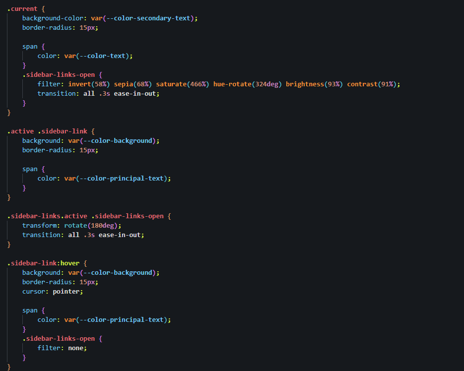
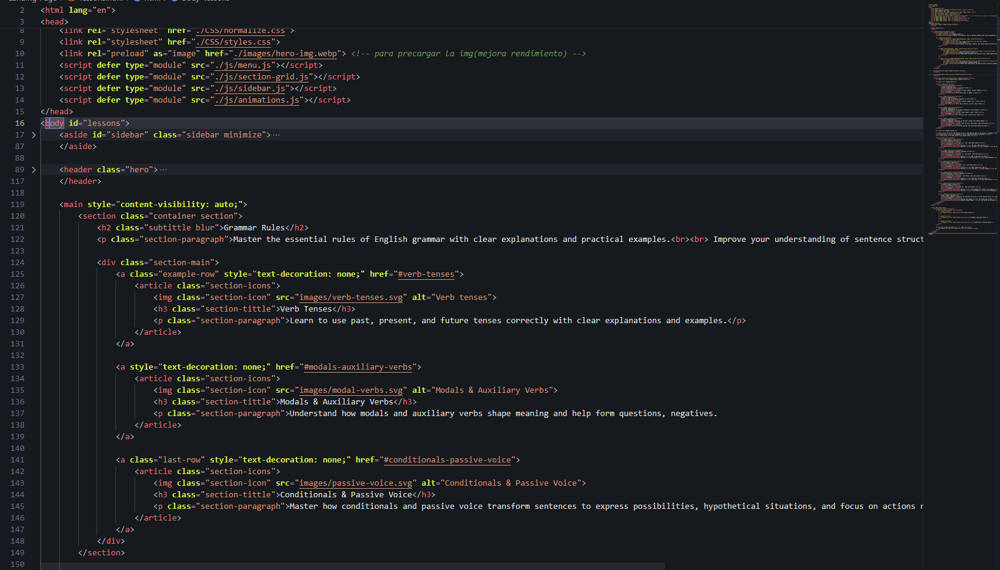
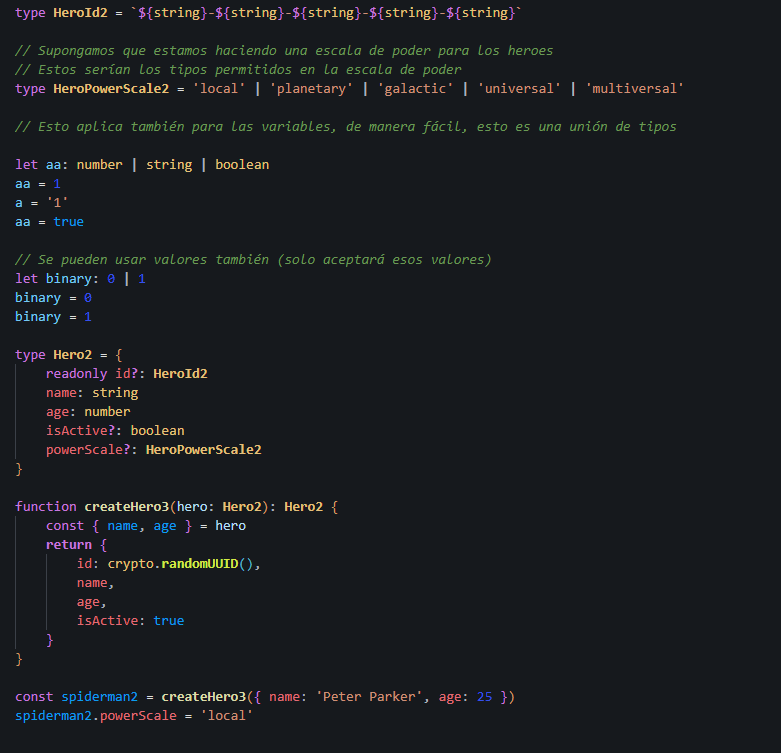

# VSCode Configuration

Este repositorio contiene mi configuración personal de **VSCode**. \
Incluye varios ajustes de apariencia, accesibilidad y productividad para optimizar mi flujo de trabajo.

---

## 📋 Descripción del contenido del README:

1. **Tema y Extensiones**: Detalles de las extensiones `One Dark Pro` y `Material Icon Theme`.
2. **Keybindings**: Comandos personalizados para crear archivos y carpetas de manera más eficiente.
3. **Snippet**: Un ejemplo de snippet para `console.log()`.
4. **Instrucciones de Instalación**: Cómo aplicar esta configuración a tu instalación de VSCode.

---

Espero que te sea útil este `README.md`. Puedes personalizarlo aún más si lo deseas.

## Capturas de Pantalla de mi VSCode

A continuación, te muestro cómo se ve mi configuración de VSCode trabajando con diferentes lenguajes: **CSS**, **HTML**, **TypeScript** y **JavaScript**.

### **JavaScript (JS)**


### **CSS**



### **HTML**



### **TypeScript (TS)**



## 1 - Extensiones Utilizadas

- ### **One Dark Pro**  
   Uso la extensión **One Dark Pro** para un tema oscuro elegante y cómodo para la vista.  
   El tema específico que utilizo es **One Dark Pro Night Flat**.

   - Puedes instalarlo directamente desde [One Dark Pro](https://marketplace.visualstudio.com/items?itemName=zhuangtongfa.Material-theme).

- ### **Material Icon Theme**  
   Esta extensión proporciona iconos visualmente atractivos para los archivos y carpetas en el explorador de VSCode, lo que facilita la navegación por el proyecto.

   - Instálalo desde [Material Icon Theme](https://marketplace.visualstudio.com/items?itemName=PKief.material-icon-theme).

## 2 - Configuración de Teclado (Keybindings)

He añadido varios **keybindings personalizados** para facilitar la creación de carpetas y archivos con reglas específicas.\
Esto mejora la velocidad de trabajo y la organización del proyecto.\
Añadí reglas para que tenga que estar a la vista y focus el explorador de archivos.

### Keybinding para Crear Carpetas

```json
{
    "key": "s",
    "command": "explorer.newFolder",
    "when": "explorerViewletVisible && filesExplorerFocus && !explorerResourceReadonly && !inputFocus"
}
```

### Keybinding para Crear Archivos

```json
{
    "key": "a",
    "command": "explorer.newFile",
    "when": "explorerViewletVisible && filesExplorerFocus && !explorerResourceReadonly && !inputFocus"
}
```

## 3 - Snippets

He creado un snippet personalizado para facilitar la escritura de **console.log()**.\
Este snippet permite insertar rápidamente un **console.log()** con el cursor dentro de los paréntesis y pulsando tab pasarías a la siguiente linea.\
Está creado para:
- javascript.json.
- javascriptreact.json.
- typescript.json.
- typescriptreact.json.

### Snippet para console.log()

```json
"Console Log": {
    "prefix": "clg",
    "body": [
        "console.log($1);"
        "$2"
    ],
    "description": "Log output to console"
}
```

## 4 - Instalación

Para instalar esta configuración en tu VSCode, simplemente sigue estos pasos:

### 1. Clona este repositorio en tu máquina:

```bash
git clone git@github.com:araldev/vscode-config.git
```

### 2. Copia el contenido de los archivos de configuración a las carpetas adecuadas en tu instalación de VSCode:
- **settings.json:** Ajustes personalizados del editor.
- **keybindings.json:** Configuración de teclas rápidas.
- **snippets/:** Coloca cualquier snippet personalizado en la carpeta `snippets/` de tu configuración.